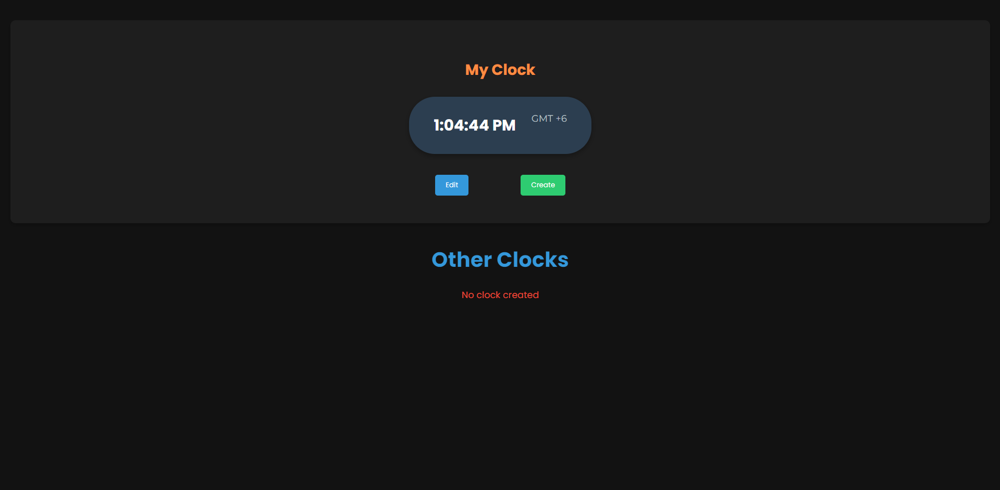

# Track Zone App

This is a responsive world clock app built with React that allows users to create and manage clocks for different time zones. The app includes a local clock, and users can add multiple clocks with custom time zones and offsets. The app is designed with a dark theme and solid color schemes.

## Features

- **Add Multiple Clocks:** Create clocks for various time zones.
- **Local Clock:** View and edit the local clock.
- **Responsive Design:** The app is fully responsive and optimized for various screen sizes.
- **Dark Theme:** Consistent dark theme throughout the app.
- **Simple UI:** Clean and user-friendly interface.

## Technologies Used

- **React:** A JavaScript library for building user interfaces.
- **Material-UI:** For enhanced UI components like dialogs and forms.
- **CSS Modules:** For styling the components in a modular way.
- **Shortid:** For generating unique IDs for clocks.

## Installation

1. **Clone the repository:**

   ```bash
   git clone https://github.com/yourusername/world-clock-app.git
   cd Track_Zone
   yarn or npm install
   yarn dev or npm run dev
   ```

2. **Visual looks:**
   
   
   
   

This is a responsive world clock app built with React that allows users to create and manage clocks for different time zones...
